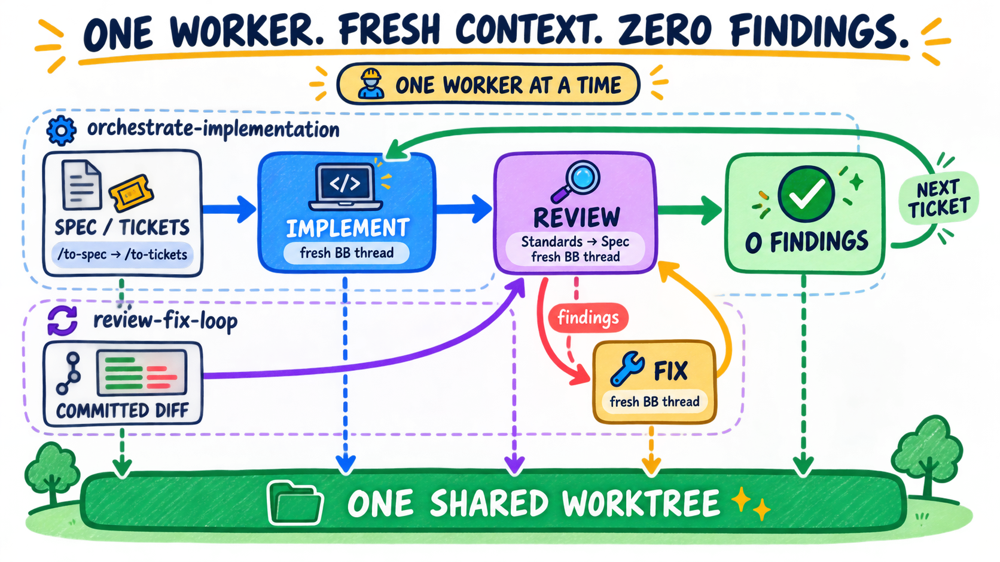

# bb orchestration skills

[](https://skills.sh/amrtawfik160/bb-orchestration-skills)

These skills are built for [Matt Pocock's agent skills](https://github.com/mattpocock/skills).
They orchestrate his `/to-spec`, `/to-tickets`, `/implement`, `/tdd`, and
`/code-review` flow inside BB. They do not replace those skills.

I wanted fresh context without an agent swarm. One worker gets one job, then
hands the work to a new thread. Fixes share one worktree, and each new reviewer
checks the whole diff from the original base. A clean review advances the run.
If findings repeat or do not decrease, the orchestrator diagnoses the cause
once and pauses for a human decision. Each gate allows at most three reviews.



## Skills

### `orchestrate-implementation`

Takes a spec or ordered tickets. It implements one unit at a time, reviews it,
fixes verified findings, and runs a final integration review.

### `review-fix-loop`

Starts with an existing committed diff. It reviews and fixes from one pinned
base until the review is clean or the run pauses for a human decision.

## What they enforce

- One active worker at a time.
- A fresh BB thread for every implementation, review, fix, and re-review.
- One shared worktree, so accepted commits remain visible to later workers.
- A clean managed worktree when the source checkout has unrelated changes.
- Standards first, then Spec, in one reviewer with no child agents.
- Re-review from the original base after every fix.
- At most three reviews per gate; repeated root causes trigger diagnosis and a
  pause instead of an infinite loop.
- Small worker prompts that invoke Matt's skills and attach source material.

## Requirements

- `bb` on `PATH` and a BB project thread.
- The `bb-cli` skill.
- [Matt Pocock's skills](https://github.com/mattpocock/skills), including
  `implement`, `tdd`, `code-review`, and `diagnosing-bugs`.
- `/to-spec` and `/to-tickets` when using the full planning flow.
- A configured issue tracker through `/setup-matt-pocock-skills`.

## Install

Install from skills.sh and choose one or both skills:

```bash
npx skills add amrtawfik160/bb-orchestration-skills
```

Start the orchestrator in a new BB environment after installing or updating.
BB pins skill revisions when an environment loads, so an already-open
environment continues using its previous revision.

Or copy them into BB's default user skill directory:

```bash
git clone https://github.com/amrtawfik160/bb-orchestration-skills.git
mkdir -p ~/.bb/skills
cp -R bb-orchestration-skills/skills/* ~/.bb/skills/
```

## Use

```text
/orchestrate-implementation <spec or ordered ticket references>
/review-fix-loop <fixed-point> [spec or ticket reference]
```

## License

MIT
