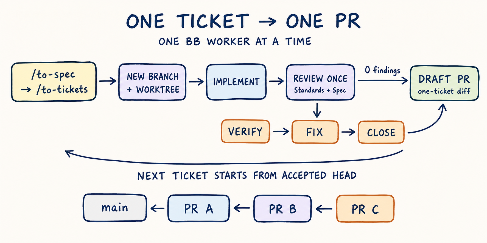

# bb orchestration skills

[](https://skills.sh/amrtawfik160/bb-orchestration-skills)

These skills run [Matt Pocock's agent skills](https://github.com/mattpocock/skills)
inside BB. They coordinate his `/to-spec`, `/to-tickets`, `/implement`, `/tdd`,
and `/code-review` flow, and route hard defect tickets through
`/diagnosing-bugs`. Matt's skills still do the underlying work.

Tickets run serially. Each ticket gets its own branch, managed worktree,
review-fix gate, and pull request. Each worker gets one job in a fresh thread
with access only to that ticket's worktree. During review, Matt's `/code-review`
starts its required independent Standards and Spec subagents.

The orchestrator runs `review-fix-loop` directly. That skill starts the fresh
review, verification, and fix workers, so there is no nested coordinator.

Each gate runs one full review. A fresh worker treats each finding as a
hypothesis and checks its cited evidence before fixing it. Afterward, another
fresh worker confirms that each finding is closed and reviews the fix delta for
regressions. The workflow does not rerun
`/code-review` to chase a zero-finding result. The `/code-review` guide warns
that repeated reviews are nondeterministic and may not converge.



## Skills

### `orchestrate-implementation`

Processes an approved ticket graph one ticket at a time, following its blocker
frontier. Planned work and known fixes use `/implement`; hard, unexplained,
intermittent, and performance defects use `/diagnosing-bugs`. Each ticket is
reviewed, its confirmed findings are fixed, and one draft PR is pushed before
the next ticket starts in a new environment. Later PRs stack on the previous
ticket branch, so each PR keeps a one-ticket diff.

### `review-fix-loop`

Starts from an existing committed diff. It runs one two-axis review from a
pinned base, fixes confirmed findings, and verifies that they are closed.

## What they enforce

- One active worker at a time.
- A fresh BB thread for every implementation, diagnosis, review, finding check,
  fix, and closure check.
- One branch and managed worktree per ticket; only that ticket's workers share
  it.
- One draft PR per accepted ticket, with the issue left open until merge.
- A linear PR stack that lets work continue without cumulative PR diffs.
- Cross-ticket integration only when `/to-tickets` provides an explicit
  integration ticket; there is no implicit final mega-PR.
- Every ticket in the frozen blocker graph, with missing edges and cycles
  rejected before implementation.
- A clean managed worktree when the source checkout has unrelated changes.
- Matt's separate Standards and Spec reviewers, with a guard against recursive
  agent spawning.
- One full review per gate, followed by targeted evidence and closure checks.
  Fix cycles that continue to make progress run until no root cause remains; if
  a cycle stalls, it gets one focused recovery before the run pauses.
- One approved tracer-bullet ticket per implementation or diagnosis thread,
  with the parent Spec left unchanged.
- Small worker prompts that invoke Matt's skills and attach source material.

## Requirements

- `bb` on `PATH` and a BB project thread.
- The `bb-cli` skill.
- The bundled `review-fix-loop` skill when using `orchestrate-implementation`.
- [Matt Pocock's skills](https://github.com/mattpocock/skills), including
  `implement`, `diagnosing-bugs`, `tdd`, and `code-review`.
- `/to-spec` and `/to-tickets` when using the full planning flow.
- The `pr-writer` skill, authenticated `gh`, and push access to the repository.
- A configured issue tracker through `/setup-matt-pocock-skills`.

`/to-spec`, `/to-tickets`, `/implement`, and `/ask-matt` are user-invoked.
The orchestrator consumes approved planning artifacts and gives each spawned BB
thread its own slash-command prompt. It does not model-invoke those skills in
its own context. `/ask-matt` remains a router, not a workflow step.

## Install

Install from skills.sh. Choose `review-fix-loop` alone, or install both skills
to use the orchestrator:

```bash
npx skills add amrtawfik160/bb-orchestration-skills
```

Start the orchestrator in a new BB environment after installing or updating.
BB pins skill revisions when an environment loads, so an open environment keeps
using its previous revision.

Or copy them into BB's default user skill directory:

```bash
git clone https://github.com/amrtawfik160/bb-orchestration-skills.git
mkdir -p ~/.bb/skills
cp -R bb-orchestration-skills/skills/* ~/.bb/skills/
```

## Usage

```text
/orchestrate-implementation <spec or ordered ticket references>
/review-fix-loop <fixed-point> [spec or ticket reference]
```

## License

MIT
