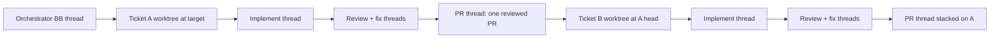

# bb orchestration skills

[](https://skills.sh/amrtawfik160/bb-orchestration-skills)

These skills run [Matt Pocock's agent skills](https://github.com/mattpocock/skills)
inside BB. They coordinate his `/to-spec`, `/to-tickets`, `/implement`, `/tdd`,
and `/code-review` flow, and route hard defect tickets through
`/diagnosing-bugs`. Matt's skills still do the underlying work.

Tickets run serially, one ticket at a time, and every phase runs in its own
visible BB thread you can watch from the IDE sidebar. Each ticket owns one
branch, one managed worktree, and one PR.
Each next worktree chains from the previous ticket's accepted head, so the
stack stays a chain of one-ticket diffs.

The BB CLI supplies context, queues, durable thread state, and worker
spawning through `bb thread spawn`. There is no invented `bb subagent`
command. A single-thread in-process alternative exists only for explicit
requests; it is never the default.

The orchestrator runs `review-fix-loop` directly. That skill starts the fresh
review, verification, and fix workers, so there is no nested coordinator.

Each gate runs one full review. A fresh worker treats each finding as a
hypothesis and checks its cited evidence before fixing it. Afterward, another
fresh worker confirms that each finding is closed and reviews the fix delta for
regressions. The workflow does not rerun `/code-review` to chase a zero-finding
result. The `/code-review` guide warns that repeated reviews are
nondeterministic and may not converge.

Once every ticket is accepted, `land-stack` merges the pull requests oldest
first, closes the tickets, and retires each ticket worktree after its merge
is confirmed. `verify-landing` then proves each merge green on the target,
and `run-status` reports where any run stands without touching it.



## Skills

### `orchestrate-implementation`

Processes an approved ticket graph one ticket at a time, following its blocker
frontier. Planned work and known fixes use `/implement`; hard, unexplained,
intermittent, and performance defects use `/diagnosing-bugs`. Each ticket gets
its own chained worktree; implementation, review, fixes, and PR work each run
in a fresh visible BB thread sharing that worktree. One draft PR is pushed
before the next ticket chains from its accepted head. Later PRs stack on the
previous ticket branch, so each PR keeps a one-ticket diff.

A fresh PR worker opens the draft PR and builds the body from
`/show-me`: the smallest diagram, call tree, or diff shape that shows what the
ticket changed, plus two sentences of context.

### `review-fix-loop`

Starts from an existing committed diff. It runs one two-axis review from a
pinned base, fixes confirmed findings, and verifies that they are closed. With
`--from-pr <url>` it takes pull request review comments as the finding source
instead of running a new review.

### `land-stack`

Ends the run. It merges the PR stack oldest first, closes each ticket, and
retires each ticket worktree after its merge is confirmed. Every
PR is gated on green checks and a head that still matches the reviewed one, and
each child is retargeted or rebased onto the target branch before it merges.
Landing stops at the first PR that cannot merge; whatever already merged stays
merged, and `resume` picks up at the next ticket.

Approval is optional. By default the loop gate and green checks are the review,
so the whole path from tickets to merged main runs without you. Pass
`--require-approvals` to also require an approving review and no unresolved
comment threads. Unresolved comments without that flag are treated as findings
and go back through the fix loop.

### `verify-landing`

Ends the cycle. It verifies each landed merge oldest first: merge-commit
checks green net of the CI baseline and quarantine, plus a smoke run in a
verify worktree at the target head. A merge that turns the target red gets a
response, never silence: fix forward only when the cause is known and one
ticket heals it, else revert first and file the fix.

### `run-status`

Answers "where does the run stand" from one ledger plus read-only thread
and PR state: ticket rows, PR checks, live children, and blockers. It is
read-only and single-turn, so it is safe to run mid-flight. The
orchestrator's `status` mode renders through it.

### `codebase-docs-cleanup`

A separate workflow, not part of the ticket-to-merge path. It applies Matt's
code-first documentation approach: make the implementation the source of truth,
and keep only what code cannot explain — decisions, domain meaning, and a thin
navigation layer.

All the work happens in a managed worktree pinned at the current `HEAD`, so your
checkout is never touched and discarding the branch reverts everything. The
inventory fans out one read-only worker per subsystem, because reading in
parallel is safe; every batch that actually edits runs alone and is verified
before the next one starts.

The navigation layer is proved by fresh threads that never saw the cleanup. A
worker that has to guess its way to a subsystem means the pointer is wrong, not
the worker. `--audit` stops after the plan, which is written to thread storage
rather than into the repository.

### `show-me`

Vendored from [humanlayer/skills](https://github.com/humanlayer/skills) under
the MIT license, with the HTML-open step pointed at BB (`bb thread open` and
an inline preview) instead of Claude Code's open command. It explains a topic
with concise diagrams, code-shape sketches, and Mermaid. The orchestrator hands
it to the PR worker; you can also invoke it directly.

### `bb-worker-protocol`

The runtime every skill above shares: how a run spawns workers, waits on them,
verifies their claims, keeps its ledger, and stacks its pull requests. It is
never invoked on its own, and it exists so that one worker rule is written once
instead of five times. Install it alongside any other skill in this bundle;
without it their reference links dangle.

## Reference files

The skills stay short because the mechanics live in reference files. Anything
more than one skill needs lives under `bb-worker-protocol`, so dependencies
point down rather than sideways; a test fails any skill that reaches into a
peer's `references/`.

| File | Owns |
|------|------|
| `bb-worker-protocol/references/bb-workers.md` | Exact `bb` commands to spawn, wait on, inspect, and verify workers; interactions; GitHub access; budgets; pausing, notification, and auto-resume |
| `bb-worker-protocol/references/worker-footer.md` | The `WORKER_RESULT` footer every worker ends with, attached to each spawn |
| `bb-worker-protocol/references/validation.md` | Resolving the check command, the baseline, who runs it, and when to rerun a time-shaped suite |
| `bb-worker-protocol/references/example-run.md` | One three-ticket run end to end, with the real values at every gate |
| `review-fix-loop/references/ledger.md` | Loop ledger schema under `$BB_THREAD_STORAGE` |
| `review-fix-loop/references/quarantine.md` | Flake patterns, quarantine records, and the reopen budget |
| `bb-worker-protocol/references/run-ledger.md` | Run ledger schema, including per-phase provider and model choices, landing, and verification state |
| `bb-worker-protocol/references/pr-stack.md` | CI baseline, the check sweep, ready state, squash-merge rebases, review comments, merge order |
| `orchestrate-implementation/references/worker-prompts.md` | The implementation, diagnosis, and pull request prompts |
| `orchestrate-implementation/references/recovery.md` | Rebuilding a stack from an older single-branch run |
| `verify-landing/references/red-main.md` | Red-target classification and the revert-first response |
| `run-status/references/format.md` | The one-pane status sections and field mapping |
| `codebase-docs-cleanup/references/inventory.md` | Classification classes, evidence table, and the keep/trim/merge/delete decision rules |
| `codebase-docs-cleanup/references/pruning.md` | The five prose tests, `AGENTS.md` rules, navigation pointers, and code-readability limits |
| `codebase-docs-cleanup/references/ledger.md` | Cleanup ledger schema, including the validation baseline and navigation checks |

## What they enforce

- One active worker at a time, except for read-only workers that never write.
- A fresh visible BB thread for every phase, stopped after its result is
  recorded so the thread and log stay inspectable from the sidebar.
- An orchestrator that listens instead of polls: one blocking wait covers a
  phase, with no log reads and no status nudges while workers run.
- User stops that stick: a stopped worker pauses with its partial output,
  never respawns, and the watchdog leaves a user-stopped thread alone.
- One branch and managed worktree per ticket; only that ticket's workers share
  it.
- Worker claims are verified in the worktree: clean tree, expected `HEAD`, and
  the resolved validation command rerun by the orchestrator. BB's own reading of
  the worker's workspace corroborates it, so the checks hold when the worktree
  lives on another machine.
- One draft PR per accepted ticket, with the issue left open until merge. The
  PR is marked ready when its checks pass; a failing check pauses before the
  next ticket stacks on it.
- A linear PR stack that lets work continue without cumulative PR diffs, and a
  rebase procedure that keeps each child at one ticket after a squash merge.
- Cross-ticket integration only when `/to-tickets` provides an explicit
  integration ticket; there is no implicit final mega-PR.
- Every ticket in the frozen blocker graph, with missing edges, cycles, and
  tickets without acceptance criteria rejected before implementation.
- A clean managed worktree when the source checkout has unrelated changes.
- Matt's separate Standards and Spec reviewers, with a guard against recursive
  agent spawning.
- One full review per gate, followed by targeted evidence and closure checks.
  Fix cycles that continue to make progress run until no root cause remains; if
  a cycle stalls, it gets one focused recovery before the run pauses.
- Worker and wall-clock budgets per ticket and per loop as safety caps.
- A resumable ledger, and a defined pause: state written, evidence reported,
  nothing torn down. Worker questions the ticket cannot answer are forwarded to
  you and relayed back on resume.
- Every pause classified. Rate limits and other transient stalls clear
  themselves through a scheduled resume; only real decisions reach you, with the
  command that continues the run.
- A run that crosses turns without you. Every turn ends in a terminal state or
  with its `[continuation]` row queued as it ends, naming the skill and ledger,
  and hands off to a fresh orchestrator before context runs out. It waits
  inside the turn while a worker runs and wakes every ten minutes while only
  CI is pending, so it never spins, and a watchdog automation re-arms it if BB
  loses its queued continuation or a turn ends with nothing queued. A brief
  `[continuation]` row in the IDE Queue panel between turns is normal and safe
  to ignore.
- A CI baseline taken before the first ticket, so a repository whose default
  branch is already red does not read as a red ticket and strand the stack.
- A review gate that must be written down. The PR step reads the recorded
  verdict, so a gate that was never recorded blocks the PR instead of passing
  silently.
- Merges in stack order, with cleanup gated on a merge confirmed at the remote.
- Verification of every landed merge on the target, with a revert-first
  response and a filed fix ticket when a merge turns the target red.
- Flake quarantine with a repair ticket, and a pause with a diagnosis bundle
  when a finding reopens twice. Converging work still runs to zero.
- One-pane run status from the ledger that reads everything and touches
  nothing.
- One approved tracer-bullet ticket per implementation or diagnosis thread,
  with the parent Spec left unchanged.
- Small worker prompts that invoke Matt's skills and attach source material.

## Why serial

Independent tickets could run in parallel worktrees, but the linear PR stack
depends on each ticket branching from the previous accepted head. Parallel
tickets would each branch from the target and need a merge step to reconcile,
which is the cumulative integration this workflow avoids. Serial order also
keeps one review gate and one validation run per ticket.

Parallelism would not buy much anyway. The orchestrator verifies every worker
claim in the worktree and reruns validation itself, so its own context is the
bottleneck, not wall-clock. A 19-ticket run measured 496K of 1M tokens across
eight tickets: running them concurrently would spend the same context sooner and
make the ledger harder to keep consistent. Throughput comes from turn
continuation and the successor relay, which let one run cross as many turns and
threads as it needs, not from more workers at once.

Read-only workers are the exception. Anything that never writes may fan out,
which is why `codebase-docs-cleanup` inventories subsystems in parallel.

## Requirements

- `bb` on `PATH` and a BB project thread.
- The `bb-cli` skill. BB ships it, and `bb skill install-cli-skills` copies it
  into `~/.claude/skills` and `~/.agents/skills` for agents that run outside
  BB. Those copies do not follow a BB upgrade: when
  `bb skill cli-skills-status` reports `outdated`, run the install command
  again, or the copy keeps describing commands and flags the installed CLI no
  longer has.
- The bundled `review-fix-loop`, `land-stack`, `verify-landing`, `run-status`,
  and `show-me` skills when using `orchestrate-implementation`.
- [Matt Pocock's skills](https://github.com/mattpocock/skills), including
  `implement`, `diagnosing-bugs`, `tdd`, and `code-review`.
- `/to-spec` and `/to-tickets` when using the full planning flow.
- Authenticated `gh` and push access to the repository. The
  [`gh-axi`](https://github.com/kunchenguid/gh-axi) skill is preferred over raw
  `gh` when installed; it wraps the same auth in a lower-token CLI. Install it
  with `npx skills add kunchenguid/gh-axi --skill gh-axi -g`.
- A configured issue tracker through `/setup-matt-pocock-skills`.

`/to-spec`, `/to-tickets`, `/implement`, and `/ask-matt` are user-invoked.
The orchestrator consumes approved planning artifacts and gives each worker
thread a bounded task with attached skill sources. `/ask-matt` remains a router, not a workflow step.

## Install

Install from skills.sh. `review-fix-loop`, `codebase-docs-cleanup`, and
`show-me` work on their own; the orchestrator needs the whole set:

```bash
npx skills add amrtawfik160/bb-orchestration-skills
```

Start the orchestrator in a new BB environment after installing or updating.
BB pins skill revisions when an environment loads, so an open environment keeps
using its previous revision. No child threads in the sidebar is the symptom of
a stale pin: start a new environment.

Or copy them into BB's user skill directory, which is `skills/` inside the bb
data directory. That is `~/.bb/skills` by default; `bb status` prints the data
directory this server actually uses.

```bash
git clone https://github.com/amrtawfik160/bb-orchestration-skills.git
mkdir -p ~/.bb/skills
cp -R bb-orchestration-skills/skills/* ~/.bb/skills/
```

Every skill except `run-status` and `show-me` reads reference files from
`bb-worker-protocol`, so install that one alongside whichever you use:

| Skill | Needs |
|-------|-------|
| `orchestrate-implementation` | `bb-worker-protocol` |
| `review-fix-loop` | `bb-worker-protocol` |
| `land-stack` | `bb-worker-protocol` |
| `verify-landing` | `bb-worker-protocol` |
| `codebase-docs-cleanup` | `bb-worker-protocol` |
| `run-status` | nothing |
| `show-me` | nothing |

No skill reads another skill's `references/` any more; a test enforces it.
Updating from a version before that change leaves stale copies of
`bb-workers.md`, `worker-footer.md`, and `subagents.md` under
`review-fix-loop/references/`, and of `ledger.md` and `pr-stack.md` under
`orchestrate-implementation/references/`. Delete those directories before
copying rather than merging over them.

## Usage

The unattended path is one command:

```text
/orchestrate-implementation <spec or ordered ticket references> --land
```

That implements every ticket, reviews and fixes each one, opens the PR stack,
merges it oldest first, closes the tickets, retires the ticket worktrees, and
proves each merge green on the target. It stops
only for a decision it cannot make.

The individual entry points:

```text
/orchestrate-implementation <spec or ordered ticket references>
/orchestrate-implementation resume
/orchestrate-implementation status
/land-stack [run ledger path] [--method merge|squash|rebase] [--require-approvals] [--keep-environments]
/land-stack resume
/verify-landing [run ledger path]
/verify-landing resume
/run-status [ledger path]
/review-fix-loop <fixed-point> [spec or ticket reference] [--from-pr <url>]
/show-me
```

## Tests

```bash
bash tests/run.sh              # prose and CLI drift guards, free and offline
bash tests/run.sh --scenarios  # also ask a model to behave under pressure
```

Every script under `tests/` runs. Most check the skill contracts. Five go
further:

- `bb-commands.sh` verifies that every `bb` command and flag in the worker
  protocol exists in the installed CLI, so the docs cannot drift from it.
- `cli-semantics.sh` pins the `bb` behaviour the protocol depends on, not just
  the flags: how log paging truncates, what the work-status fields mean, where
  a terminal's exit code lives, and what the merge command cannot assert.
  Inside a BB thread it also parses a real paged log.
- `pr-stack-rebase.sh` runs the documented squash-merge rebase against a
  temporary Git repository and proves each child PR still holds one ticket.
- `land-stack-order.sh` runs the documented landing sequence against stubbed
  `gh` and `bb`, proving PRs merge oldest first, that an environment is
  archived only after its merge is confirmed, and that a failing check stops
  the run without touching the rest of the stack.
- `scenarios.sh` tests behaviour rather than prose. Each file in
  `tests/scenarios/` puts a fresh agent in a situation where following the
  skill costs something — a repo owner offering to take the blame, a budget
  that a second validation run will exhaust — and checks which way it went.
  `--baseline` runs the same scenarios with no skill loaded and fails any that
  a skill-less agent already gets right, so a rule only earns words in a skill
  once something has been seen to go wrong without it. It spends tokens, so it
  is skipped unless `RUN_SCENARIOS=1`.

  Current results over the five scenarios: at baseline, with no skill loaded,
  1 of 15 samples chose correctly (3 per scenario). With the skill loaded,
  25 of 25 did (5 per scenario).

## License

MIT. The bundled `show-me` skill keeps its own MIT license from HumanLayer in
`skills/show-me/LICENSE`.
