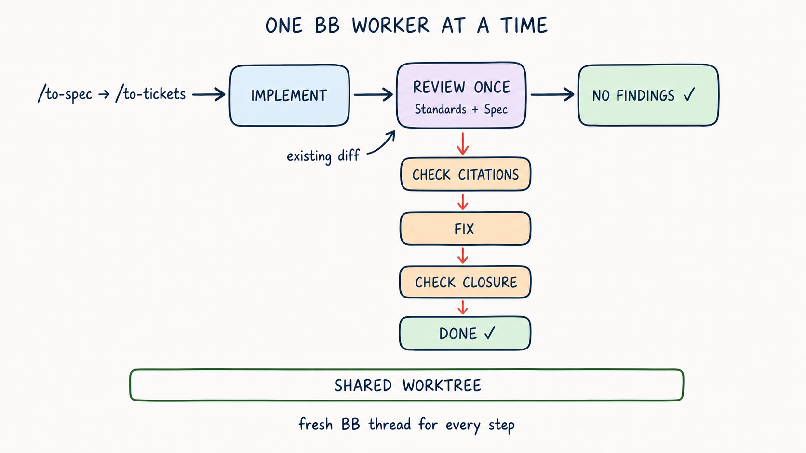

# bb orchestration skills

[](https://skills.sh/amrtawfik160/bb-orchestration-skills)

These skills are built for [Matt Pocock's agent skills](https://github.com/mattpocock/skills).
They orchestrate his `/to-spec`, `/to-tickets`, `/implement`, `/tdd`, and
`/code-review` flow inside BB, and route hard defect tickets through
`/diagnosing-bugs`. They do not replace those skills.

The BB workflow is serial: each worker gets one job in a fresh thread, and each
thread uses the shared worktree. Matt's `/code-review` is the sole exception to
that one-worker rule: inside the review thread, it uses its required independent
Standards and Spec subagents.

Each gate runs one full review. A fresh worker treats the findings as
hypotheses and verifies the cited evidence before a fixer acts. After the fix,
another fresh worker checks that every confirmed finding is closed and reviews
the fix delta for regressions. The workflow does not repeat `/code-review` in
pursuit of a zero-finding result; the `/code-review` guide warns that repeated
reviews are nondeterministic and do not promise convergence.



## Skills

### `orchestrate-implementation`

Takes an approved ticket graph and processes its blocker frontier one ticket at
a time. Planned work and known fixes use `/implement`; hard, unexplained,
intermittent, and performance defects use `/diagnosing-bugs`. Each ticket is
reviewed, corrected, and closed before the next dependent ticket starts. A
multi-ticket build ends with one integration gate.

### `review-fix-loop`

Starts with an existing committed diff. It runs one two-axis review from a
pinned base, fixes confirmed findings, and verifies their closure.

## What they enforce

- One active worker at a time.
- A fresh BB thread for every implementation, diagnosis, review, finding check,
  fix, and closure check.
- One shared worktree, so accepted commits remain visible to later workers.
- Every ticket in the frozen blocker graph, with missing edges and cycles
  rejected before implementation.
- A clean managed worktree when the source checkout has unrelated changes.
- Matt's separate Standards and Spec reviewers, with a guard against recursive
  agent spawning.
- One full review per gate, followed by targeted evidence and closure checks.
  Fix cycles that continue to make progress run until no root cause remains; if
  a cycle stalls, it gets one focused recovery before the run pauses.
- One approved tracer-bullet ticket per implementation or diagnosis thread,
  with the parent Spec left unchanged.
- Small worker prompts that invoke Matt's skills and attach source material.

## Requirements

- `bb` on `PATH` and a BB project thread.
- The `bb-cli` skill.
- [Matt Pocock's skills](https://github.com/mattpocock/skills), including
  `implement`, `diagnosing-bugs`, `tdd`, and `code-review`.
- `/to-spec` and `/to-tickets` when using the full planning flow.
- A configured issue tracker through `/setup-matt-pocock-skills`.

`/to-spec`, `/to-tickets`, `/implement`, and `/ask-matt` are user-invoked.
The orchestrator consumes approved planning artifacts and gives each spawned BB
thread its own slash-command prompt. It does not model-invoke those skills in
its own context. `/ask-matt` remains a router, not a workflow step.

## Install

Install from skills.sh and choose one or both skills:

```bash
npx skills add amrtawfik160/bb-orchestration-skills
```

Start the orchestrator in a new BB environment after installing or updating.
BB pins skill revisions when an environment loads, so an already-open
environment continues using its previous revision.

Or copy them into BB's default user skill directory:

```bash
git clone https://github.com/amrtawfik160/bb-orchestration-skills.git
mkdir -p ~/.bb/skills
cp -R bb-orchestration-skills/skills/* ~/.bb/skills/
```

## Use

```text
/orchestrate-implementation <spec or ordered ticket references>
/review-fix-loop <fixed-point> [spec or ticket reference]
```

## License

MIT
